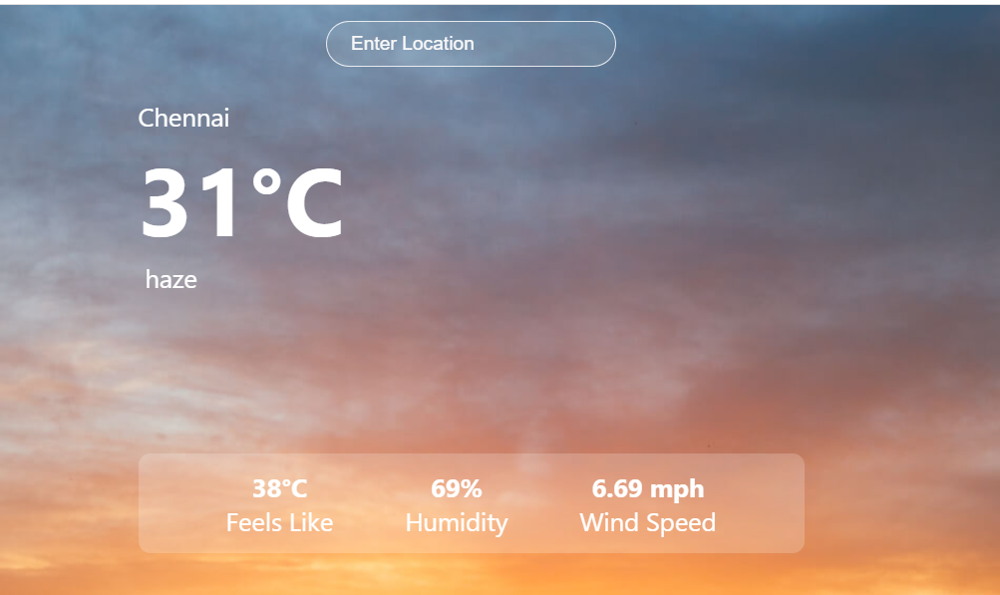

# React Weather App

This is a simple weather application built using React and Axios. It fetches weather data from a weather API and displays it to the user.

## Features

1. Fetches current weather data for a given location
2. Displays temperature, weather conditions, and other relevant information
3. Responsive design for optimal user experience on different devices
   
## Technologies Used

1. React
2. Axios
3. HTML
4. CSS

## Usage

1. Enter a location in the search bar and press Enter.
2. The app will fetch the weather data from the API and display it on the screen.

## Image of App

